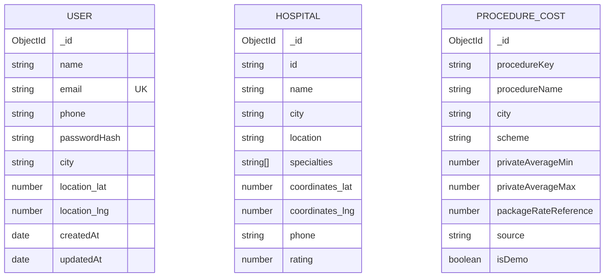

# MediGo

MediGo is a mobile-friendly healthcare discovery and emergency support web app. It helps people find hospitals by condition and location, understand care and cost options, compare and save hospitals, and access general AI-assisted health guidance.

## Why MediGo

Finding care can be difficult when someone is unwell, unfamiliar with medical terms, or unsure where to start. MediGo brings hospital discovery, map directions, simple cost references, report assistance, and emergency contact actions into one place. Search works with conditions and everyday wording; voice input and English, Hindi, Hinglish, and Punjabi support make the app easier to use for more people.

MediGo is a discovery and information tool. It does not diagnose, confirm a hospital bed, dispatch an ambulance, or replace a qualified clinician. In India, call **108** for ambulance assistance or **112** for emergency help.

## Features

- **Hospital discovery:** Search by condition, symptoms, specialty, and city; use browser location to rank hospitals by distance.
- **Hospital tools:** Filter and sort results, open map directions, call listed hospitals, save hospitals in the browser, and compare options.
- **Ask MediGo AI:** Ask general health questions in English, Hindi, Hinglish, or Punjabi. Location context can be used for hospital discovery queries.
- **Medical report reader:** Upload a JPEG, PNG, or WebP prescription/lab report image for an AI-generated summary, department suggestion, and matching hospitals. Images are sent to Gemini for processing and are not saved by the report-reader route.
- **Cost estimator:** See illustrative private-cost and PM-JAY/CGHS package-rate comparisons and matching hospitals.
- **Emergency support:** Use GPS to sort hospitals, find additional nearby map-listed hospitals, open directions, call hospitals, submit a hospital preparation alert, and use the SOS location flow.
- **Progressive Web App:** Install on supported devices and load the cached app shell when offline. Some emergency information may be cached.
- **Accessibility and language:** Responsive layouts, readable UI, voice search on supported browsers, and English, Hindi, Hinglish, and Punjabi interface options.

## Technology

| Area | Technology | How MediGo uses it |
| --- | --- | --- |
| Frontend | HTML, CSS, Tailwind CSS, browser JavaScript | Pages, responsive UI, forms, map views, filters, and browser interactions |
| Backend | Node.js and Express | REST API, input validation, auth, hospital search, Gemini calls, and emergency flows |
| Database | MongoDB and Mongoose | User accounts, report-reader hospital matching records, and procedure-cost records |
| AI | Google Gemini via `@google/genai` | Ask AI responses and multimodal medical-document summarization |
| Maps and location | Browser Geolocation, Leaflet/OpenStreetMap, Google Maps links | User coordinates, map display, navigation links, and nearby hospital discovery |
| Places lookup | OpenStreetMap Overpass API | Finds nearby named hospitals when GPS is used; the results' emergency capability is not verified |
| Geocoding | Geoapify (optional) | Resolves a coordinate to a readable address for SOS alerts |
| Email | Nodemailer over SMTP (optional) | Password-reset OTP and configured emergency/hospital notifications |
| Offline support | Web App Manifest and Service Worker | Install prompt, cached app shell, and selected cached public GET responses |

## Repository structure

The frontend and backend are separate folders/repositories. For local development, place them side by side:

```text
MediGo/
├── MediGo-Backend/
│   ├── api/index.js                 # Serverless adapter
│   ├── data/procedure-costs.js      # Development-only illustrative rates
│   ├── models/
│   │   ├── Hospital.js
│   │   ├── ProcedureCost.js
│   │   └── User.js
│   ├── routes/
│   │   ├── cost-estimate.js
│   │   └── report-reader.js
│   ├── scripts/seed-procedure-costs.js
│   ├── server.js                    # Express app and core API routes
│   ├── package.json
│   └── .env.example
└── MediGo-Frontend/
    └── public/
        ├── index.html               # Main search and discovery page
        ├── results.html             # Search results
        ├── compare.html             # Hospital comparison
        ├── emergency.html           # Emergency support
        ├── admin.html               # Admin interface
        ├── offline.html             # Offline fallback
        ├── manifest.json
        ├── sw.js                    # Service worker
        ├── css/style.css
        └── js/
            ├── main.js              # Search, results, filters, saved hospitals
            ├── auth.js              # Signup, login, profile, password reset UI
            ├── chat.js              # Ask AI interface and voice input
            ├── report-reader.js     # Report upload and analysis UI
            ├── cost-estimator.js    # Procedure estimate UI
            ├── emergency.js         # Hospital preparation alert page
            ├── sos-dispatch.js      # SOS location flow
            ├── compare.js           # Comparison page
            ├── i18n.js              # Interface translations
            └── config.js            # Frontend API base URL
```

The Express app serves `MediGo-Frontend/public` when the two directories are siblings. In development, open the app at `http://localhost:3000`; the frontend then calls the local API at the same port.

## Application flow

1. The browser renders the static HTML and JavaScript pages.
2. Frontend modules call the Express API using `fetch` and JSON, except report images, which are sent as raw image bytes.
3. Express validates input, applies authentication where required, and calls MongoDB, Gemini, Geoapify, OpenStreetMap Overpass, or SMTP as needed.
4. The API returns JSON to the browser. The UI renders hospital cards, analysis, estimates, or status messages.
5. Public directory data and user preferences are partly kept locally for fast loading and offline use.

## Database design

MongoDB is accessed through Mongoose. The current database-backed models are:

### `users`

`User` stores account and profile data: name, unique normalized email, phone, password hash, city, optional coordinates, timestamps, and password-reset OTP hash/expiry/attempt fields. Password hashes and reset hashes are excluded from ordinary query results. Password reset OTPs expire after 60 seconds and are stored as hashes.

### `hospitals`

`Hospital` stores a hospital ID, name, city/location, specialties, coordinates, phone, rating, emergency and ICU bed fields, and additional directory fields. The report-reader route can use this collection to match AI-suggested departments. The primary `/api/hospitals` public directory currently comes from the bundled hospital dataset in `server.js`; populate and wire a database directory before treating MongoDB as the authoritative source for all hospital results.

### `procedure_costs`

`ProcedureCost` stores a procedure key/name, specialty, city, scheme (PM-JAY or CGHS), private-cost range, package-rate reference, package code, source/source URL, review date, demo flag, and active flag. A compound index strategy should be added before scaling city/procedure lookups. The supplied development rates are illustrative and marked as demo data, not official or guaranteed prices.

### Data currently held outside MongoDB

- Hospital reviews and emergency request records use in-memory server stores in this version; they reset when the process restarts.
- Saved hospitals, comparison selections, theme, and language are stored in the user's browser `localStorage`; they are not synced between devices or user accounts.
- Nearby hospitals discovered from OpenStreetMap are returned for the current request and are not inserted into the MediGo database.



## Important API routes

| Route | Purpose | Access / notes |
| --- | --- | --- |
| `GET /api/health` | Server, database, SMTP, and Gemini readiness | Public health status |
| `POST /api/auth/signup` | Create an account | Requires MongoDB |
| `POST /api/auth/login` | Sign in | Returns a signed token |
| `POST /api/auth/forgot-password` | Email a reset OTP | Requires configured SMTP |
| `POST /api/auth/reset-password` | Verify OTP and change password | OTP expires after 60 seconds |
| `GET /api/hospitals` | List/filter hospitals; accepts city, specialty, and coordinates | Public bundled directory |
| `GET /api/hospitals/nearby` | Merge registered emergency hospitals with nearby map-listed hospitals | GPS coordinates required; default radius 50 km (maximum 100 km) |
| `POST /api/hospitals/search` | Search/match hospitals by condition, city, and location | Public search endpoint |
| `POST /api/chat` | Ask MediGo AI a question | Gemini key recommended; no medical diagnosis |
| `POST /api/reports/analyze` | Analyze a raw JPEG/PNG/WebP image | Bearer token required; up to 8 MB; Gemini key recommended |
| `GET /api/cost-estimate/options` | List procedures, cities, and scheme options | Public |
| `POST /api/cost-estimate` | Create a procedure estimate | Bearer token required |
| `POST /api/emergency/dispatch` | Submit GPS SOS alert and optional email | SMTP and recipient configuration needed for email; does not dispatch an ambulance |
| `POST /api/emergency/notify-hospital` | Send a preparation alert to a configured listed hospital | Bearer token is not required in the current implementation; SMTP/hospital inbox required |
| `GET /api/reviews`, `POST /api/reviews` | Read and submit hospital reviews | Review submission requires authentication; storage is currently in-memory |

## Local setup

### Requirements

- Node.js 20 or newer
- npm
- MongoDB Atlas or a local MongoDB instance for account and persistent database features

### Install and run

```bash
cd MediGo-Backend
npm install
cp .env.example .env
```

Add credentials to `.env` as needed, then start the app:

```bash
npm start
```

Open [http://localhost:3000](http://localhost:3000). Check [http://localhost:3000/api/health](http://localhost:3000/api/health) to see which integrations are connected.

To load development-only procedure cost examples into MongoDB:

```bash
npm run seed:procedure-costs
```

Do not use these sample figures for financial decisions. Replace them with current, sourced, city/state-specific data before publishing estimates as real-world guidance.

## Environment configuration

Copy `.env.example` to `.env`. Never commit the real `.env` file or expose API keys in browser JavaScript.

| Variable | Purpose |
| --- | --- |
| `NODE_ENV` | Runtime mode; set to `production` when deployed |
| `PORT`, `HOST` | Express listen port and bind address |
| `MONGODB_URI` | MongoDB connection URI |
| `JWT_SECRET` | Signing key for authentication tokens; required in production |
| `GEMINI_API_KEY` | Server-side Gemini API access for chat and report analysis |
| `GEMINI_MODEL` | Optional preferred Gemini model; use a model available to your Google AI project, for example `gemini-2.5-flash` |
| `GEOAPIFY_API_KEY` | Optional reverse geocoding for readable SOS addresses |
| `SMTP_URL` | SMTP connection URL; alternatively configure the SMTP fields below |
| `SMTP_HOST`, `SMTP_PORT`, `SMTP_SECURE`, `SMTP_USER`, `SMTP_PASS`, `SMTP_FROM` | SMTP connection, credentials, and sender |
| `EMERGENCY_HOSPITAL_EMAIL` | Fallback recipient for emergency notification email |
| `EMERGENCY_HOSPITAL_EMAILS` | Optional JSON object mapping MediGo hospital IDs to emergency inboxes |
| `CORS_ORIGINS` | Comma-separated deployed frontend origins |
| `SITE_OWNER_EMAIL` | Optional site owner configuration value |

### Feature integration checklist

- **Account signup/login and report reader:** set `MONGODB_URI` and a strong `JWT_SECRET`.
- **AI chat and report reader:** set `GEMINI_API_KEY`; keep it only on the backend.
- **Password reset and emergency email:** configure SMTP credentials and sender.
- **Emergency SOS email:** also set an emergency recipient. Email delivery does not confirm that the hospital received or acted on the alert.
- **Readable GPS address:** set `GEOAPIFY_API_KEY`; coordinates and Maps links can still be used without it.
- **Browser GPS and PWA installation:** serve through HTTPS in deployment. `localhost` is allowed for development. Users must grant location permission and enable device location services.

## Privacy and safety

- Keep MongoDB, Gemini, Geoapify, JWT, and SMTP credentials in backend environment variables.
- Report images are processed by Gemini and are not stored by the report-reader endpoint. Do not upload documents without the patient's permission; redact identifiers when possible.
- Browser location is requested for location-based results and emergency flows. It is sent to the backend only for the requested nearby search or alert.
- OpenStreetMap hospital entries are map-discovered listings. Bed count, emergency reception, contact details, and current availability may be unknown; call to confirm before travel.
- SOS email is a notification, not a confirmed ambulance dispatch. Call emergency services directly.
- AI output and cost estimates can be incomplete or wrong. Confirm medical decisions with a qualified clinician and scheme pricing/eligibility with the hospital or official scheme helpdesk.

## Deployment

The backend includes `vercel.json` and `api/index.js` for serverless hosting. Configure environment variables in the hosting provider, set `CORS_ORIGINS` to the frontend origin, and update `MediGo-Frontend/public/js/config.js` to point at the deployed API URL. Deploy the frontend over HTTPS so geolocation and PWA service-worker features work.

## License

No license file is currently included. Add a license before granting permission for others to reuse or redistribute the project.
